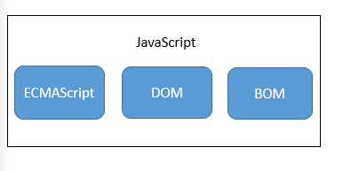

## 1.1 Javascript实现
如图所示，一个完整的JavaScript实现由下列三个不同的的部分组成。
* 核心（ECMAScript）
* 文档对象模型（DOM）
* 浏览器对象模型（BOM）

### 1.1.1 ECMAScript
Web浏览器只是ECMAScript实现可能的宿主环境之一。宿主环境不仅提供基本的ECMAScript实现，同时也会提供该语言的扩展，以便语言和环境之间的对接。而这些扩展-如DOM，则会利用ECMAScript的核心类型和语法提供更多的具体的功能，以便实现针对环境的操作。
大致来说，它规定了这门语言的下列组成部分：
* 语法
* 类型
* 语句
* 关键字
* 保留字
* 操作符
* 对象

综上所述，JS是基于ECMAScript规定所实现的语言。

### 1.1.2 文档对象模型（DOM）
DOM将网页映射为一个多层节点的结构，通过DOM提供的API开发人员可以轻松自如的删除、添加、替换和修改任何节点。

> 提供访问和操作页面内容的方法和接口。

### 1.1.3 浏览器对象模型（BOM）
提供与浏览器交互的方法和接口。
